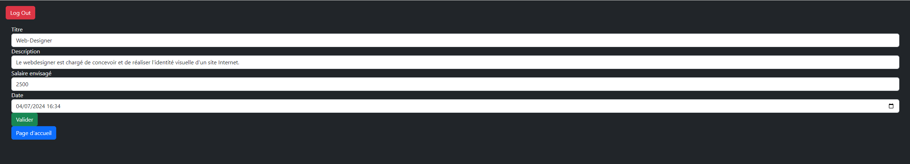

# Gestionnaire d'offre d'emploi

L'application que vous avez à votre disposition vous permet de simuler un gestionnaire d'offre d'emploi ainsi que de pouvoir
postuler si une offre vous intéresse 

## Installation

Pour pouvoir tester ce projet il vous suffit de faire un pull sur le repo GitHub et de remplir le fichier "application.properties"

Après avoir rempli les champs nécessaire pour pourrez donc tester mon application codé avec Spring, Mysql et Thymleaf

Vous n'avez plus qu'a vous rendre sur votre navigateur à l'adresse suivante [appli](http://localhost:8080/).

Ce qui vous aménera donc à la page web pour vous inscrire.

Inscrivons nous via ce formulaire si vous le voulez bien 

Puis après vous avoir été inscrit vous pourrez donc avoir accès à la page de connexion

Et si vous avec bien retenu votre mot de passe vous pourrez donc avoir accès à un page qui offre un résumé des offre d'emplois disponibles afin de trouver votre bonheur

Voila nous avons donc accès à une list d'offre d'emploi pour lesquels en tant que candidats il est possible de postuler 

Prenons donc un Rendez-Vous avec Monsieur John Doe pour essayer le service 

Et voilà dans la liste de nos rendez-vous le meeting à bien été ajouté

Maintenant testons l'application du coté Administrateur si vous le voulez bien

Pour commencer nous devons changer de compte donc utilison le bouton logout pour cela.

Après avoir appuyé sur le bouton nous somme revenu sur la page d'inscription et ils nous ai impossible d'aller sur les autres pages car elle ont été sécurisé

Maintenant nous pouver créer un compte adminstrateur sur la page de connexion en appuyant sur le bouton en bas du formulaire d'inscription 

Comme vous pouvez le constater la page à légerement changé en effet en tant qu'admin nous ne pouvons plus postuler mais supprimer ou modifier les offres d'emploi

Commencons par changer le salaire de la première offre pour correspondre aux prix du marché 

Voici les paramètres que nous entrons 

Et voici le résultat obtenu sur la liste des offres 

Comme nous pouvons le voir les changements ont bien été pris en compte

Pour terminer voyons l'ajout d'une offre d'emploi pour cloturer en beauté 

Comme vous pouvez le voir le formulaire est à votre disposition 

Voici le résumé de notre offre d'emploi et maintenant validons la.

Et Voila après avoir valider le formulaire notre offre est bien mise en avant sur la page de liste d'offre.

## Retour

Les retours sont bienvenue nous pouvons échanger sur mon mail profesionnel : [Fares Dries ](mailto:faresdries@gmail.com)

Merci de votre attention et je reste à votre disposition si vous avez la moindre question 

## License

[MIT](https://choosealicense.com/licenses/mit/)

## Projet

Projet réalise pour l'ECF 4 de ma formation chez M2I formation Villeneuve D'ascq